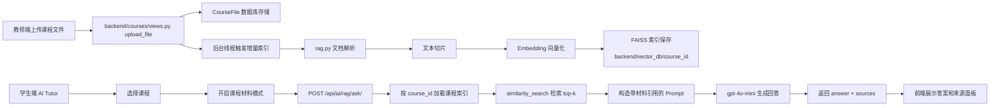
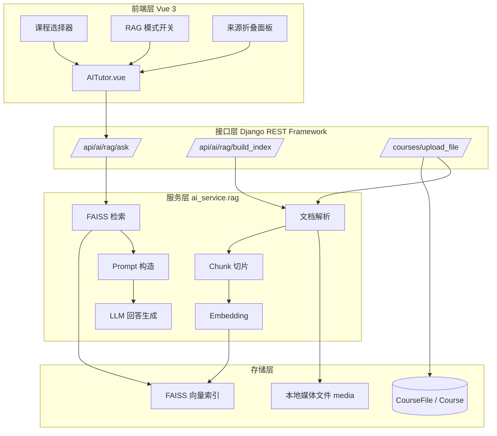
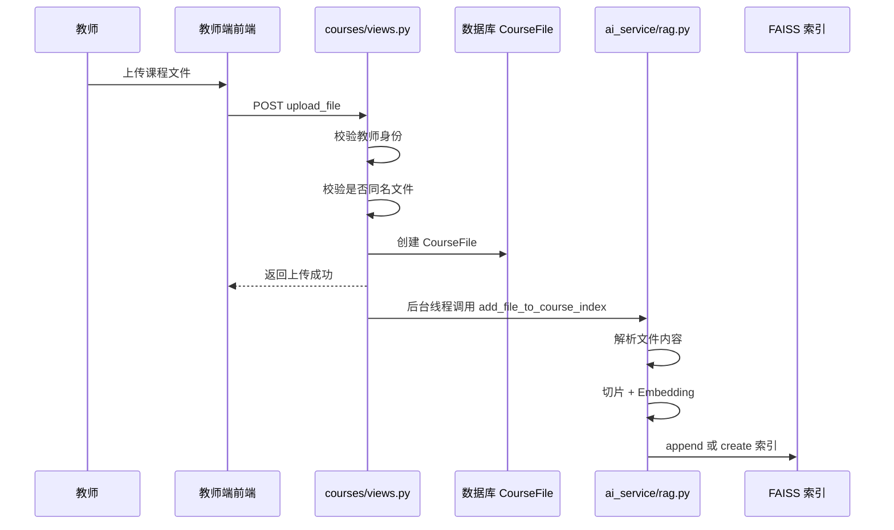
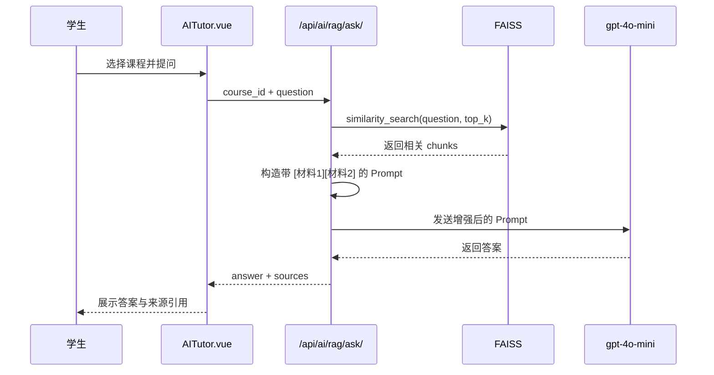
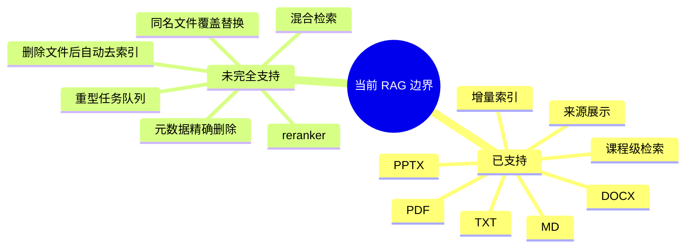

# RAG 系统架构图版说明

## 1. 总览

本项目的 RAG 架构目标是：

- 教师上传课程资料后，系统自动建立课程知识库
- 学生在 AI Tutor 中基于课程材料提问
- 系统返回答案，并附上来源引用

一句话概括：

**教师资料 -> 文档解析与向量化 -> 课程级 FAISS 知识库 -> 检索增强生成 -> 前端展示答案与来源**

---

## 2. 整体架构图

---

## 3. 分层结构图

---

## 4. 上传建库流程图

说明：

- 现在默认采用“增量索引”而不是“全量重建”
- 这样教师每次上传新文件时，只处理新文件，速度更快
- 若需要完全重扫整门课，可调用 `/api/ai/rag/build_index/`

---

## 5. 学生提问流程图

---

## 6. 技术栈映射图

| 环节 | 技术 | 作用 |
|---|---|---|
| 前端页面 | Vue 3 + Element Plus | 学生交互、模式切换、来源展示 |
| API | Django REST Framework | 提供上传、问答、建索引接口 |
| 文档解析 | pypdf / python-docx / python-pptx | 提取课程资料文本 |
| 切片 | LangChain Text Splitter | 将长文档拆成小块 |
| 向量化 | HuggingFaceEmbeddings | 把 chunk 转成向量 |
| 向量检索 | FAISS | 保存并查询课程知识库 |
| 回答生成 | ChatOpenAI + gpt-4o-mini | 基于检索结果生成答案 |
| 配置管理 | Django settings + .env | 控制模型、索引、阈值参数 |

---

## 7. 关键模块职责

### 教师上传模块

- 接收课程资料
- 保存 `CourseFile`
- 拦截同名文件重复上传
- 自动触发增量索引

### RAG 核心模块

- 解析多种文档格式
- 切片并附带 metadata
- 维护每门课程独立 FAISS 索引
- 提供全量建库和增量追加两种方式

### 问答模块

- 根据课程 ID 限定检索范围
- 检索相关片段
- 构造约束型 Prompt
- 调用 LLM 输出带引用答案

### 前端展示模块

- 让学生选择具体课程
- 切换“课程材料模式”
- 展示答案来源和页码片段

---

## 8. 为什么这样设计

### 1. 每门课独立索引

优点：

- 避免不同课程内容混淆
- 检索范围更小，速度更快
- 权限控制更自然

### 2. 增量索引优先

优点：

- 教师上传一个文件时只处理这个文件
- 比全量重建更省时间和资源

### 3. 前端显式开关 RAG 模式

优点：

- 普通聊天和课程问答共存
- 用户知道当前是否在“基于材料回答”

### 4. 回答强制附来源

优点：

- 提升可解释性
- 便于学生核验答案真实性

---

## 9. 当前方案的边界

---

## 10. PPT 可直接使用的总结页

### RAG 在本项目中的实现路线

1. 教师上传课程资料，系统保存为 `CourseFile`
2. 后端自动解析文件并切片
3. 使用多语言 embedding 将文本转为向量
4. 按课程维度保存到 FAISS 索引
5. 学生在 AI Tutor 中选择课程并开启课程材料模式
6. 系统先检索相关课程片段，再调用大模型生成答案
7. 前端最终展示答案和来源引用

### 方案特点

- 课程隔离清晰
- 成本低，部署简单
- 支持中英文课程材料
- 回答可解释，可追溯

---

## 11. 一句话答辩表述

**我们实现的是一个课程级别的轻量 RAG 系统：教师上传资料后，系统自动把文件解析、切片并写入每门课独立的 FAISS 向量库；学生提问时，先在该课程知识库中检索相关内容，再把检索结果送入 gpt-4o-mini 生成带引用的答案，最后在前端展示答案和来源。**