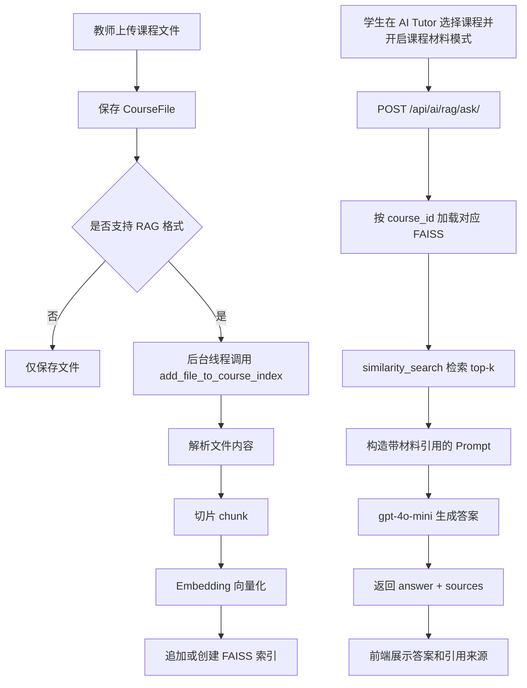

# 校园智慧学习平台 RAG 全流程实现说明

## 1. 目标

本项目的 RAG 功能用于让学生在 AI Tutor 页面中，基于教师上传的课程资料进行提问，系统返回：

- 基于课程材料生成的答案
- 对应的引用来源
- 文件名、页码、片段摘要

这样可以让回答更贴近课程内容，并尽量避免 AI 脱离材料自由发挥。

---

## 2. 整体技术栈

### 后端

| 组件 | 用途 |
|---|---|
| Django 5 + DRF | 提供课程、文件上传、RAG API |
| LangChain | 封装向量库、文档切片、LLM 调用 |
| FAISS | 存储每门课的向量索引 |
| HuggingFaceEmbeddings | 将文本 chunk 转成向量 |
| ChatOpenAI | 统一调用 OpenAI / GitHub Models |
| pypdf | 解析 PDF |
| python-docx | 解析 Word |
| python-pptx | 解析 PPT |

### 前端

| 组件 | 用途 |
|---|---|
| Vue 3 + script setup | AI Tutor 页面逻辑 |
| Element Plus | 交互组件，例如开关、折叠面板 |
| Axios 实例 | 调用后端 RAG API |
| vue-i18n | RAG 新增文案三语支持 |

### 模型与外部服务

| 组件 | 用途 |
|---|---|
| paraphrase-multilingual-MiniLM-L12-v2 | 多语言 embedding 模型 |
| gpt-4o-mini | 最终回答生成模型 |
| GitHub Models / OpenAI 兼容接口 | 提供 LLM 推理能力 |

---

## 3. 核心设计思路

本项目采用“每门课一个独立知识库”的设计。

- 教师上传的课程资料保存为 `CourseFile`
- 系统按课程维度构建向量库
- 向量索引目录为 `backend/vector_db/course_<course_id>/`
- 学生提问时必须带上 `course_id`
- 检索只在该课程的索引内进行，不跨课程搜索

这样做的好处：

- 不会把不同课程的内容混在一起
- 权限边界更清晰
- 单门课程重建或增量更新更容易控制

---

## 4. 关键文件

### 后端

- [backend/ai_service/rag.py](backend/ai_service/rag.py)：RAG 核心实现，包含文档解析、切片、建索引、增量索引、检索问答
- [backend/ai_service/views.py](backend/ai_service/views.py)：RAG API 入口
- [backend/ai_service/management/commands/index_course.py](backend/ai_service/management/commands/index_course.py)：手动建索引命令
- [backend/ai_learning_platform/settings.py](backend/ai_learning_platform/settings.py)：RAG 相关配置
- [backend/courses/views.py](backend/courses/views.py)：教师上传文件后触发自动增量索引

### 前端

- [frontend/src/views/AITutor.vue](frontend/src/views/AITutor.vue)：课程材料模式开关、RAG 请求、来源展示
- [frontend/src/locales/en.js](frontend/src/locales/en.js)
- [frontend/src/locales/zh-cn.js](frontend/src/locales/zh-cn.js)
- [frontend/src/locales/zh-tw.js](frontend/src/locales/zh-tw.js)

---

## 5. RAG 后端流程

## 5.1 文件进入系统

教师上传文件时，后端进入课程文件上传接口：

- 普通文件上传：`CourseViewSet.upload_file`
- Quiz 链接不参与 RAG

上传时做了两个和 RAG 直接相关的处理：

1. 同名文件拦截
2. 上传成功后后台异步增量索引

相关实现位置：

- [backend/courses/views.py](backend/courses/views.py)

### 同名文件拦截

如果课程内已经存在相同 `file_name`，接口会直接返回 400，避免同一份文件被二次追加进向量库，造成重复 chunks。

### 自动增量索引

若上传文件后缀属于支持格式集合：

- `.pdf`
- `.docx`
- `.pptx`
- `.md`
- `.txt`

系统会启动后台线程调用：

- `add_file_to_course_index(course_id, file_path, source_name)`

这一步只处理新文件，不会重新解析整门课所有文件。

---

## 5.2 文档解析

文档解析逻辑在 [backend/ai_service/rag.py](backend/ai_service/rag.py)。

### 支持格式与解析方式

| 格式 | 方法 | 说明 |
|---|---|---|
| PDF | `_load_pdf` | 按页提取文字，保留页码 |
| DOCX | `_load_docx` | 提取段落与表格文字 |
| PPTX | `_load_pptx` | 提取每页幻灯片文字与备注 |
| MD/TXT | `_load_text` | 直接读取文本，Markdown 做轻量去标记 |

解析后的统一结构：

```python
[
  {
    "text": "页面或文档文本内容",
    "page": 1
  }
]
```

这样后续无论文件类型是什么，切片器都可以用同一套逻辑处理。

---

## 5.3 文本切片

切片逻辑使用 `RecursiveCharacterTextSplitter`，参数来自 [backend/ai_learning_platform/settings.py](backend/ai_learning_platform/settings.py)。

当前配置：

| 参数 | 值 | 作用 |
|---|---|---|
| `RAG_CHUNK_SIZE` | 500 | 每个 chunk 大小 |
| `RAG_CHUNK_OVERLAP` | 50 | 相邻 chunk 重叠，减少语义断裂 |
| `RAG_TOP_K` | 4 | 检索返回前 4 个相关片段 |
| `RAG_MAX_DOC_CHARS` | 500000 | 超大文档截断上限 |

切片后，每个 LangChain `Document` 会附带 metadata：

```python
{
  "course_id": course_id,
  "source": source_name,
  "page": page_number,
}
```

这些 metadata 是后续“来源引用展示”的基础。

---

## 5.4 向量化与索引存储

### Embedding 模型

系统使用：

- `paraphrase-multilingual-MiniLM-L12-v2`

原因：

- 支持中英文混合语料
- 体积较小，适合项目本地加载
- 对课程资料这类通用文本场景已足够

在代码里通过 `HuggingFaceEmbeddings` 懒加载成单例，避免重复初始化。

### 向量库

系统使用 FAISS 作为本地向量数据库。

每门课的索引单独保存在：

```text
backend/vector_db/course_<course_id>/
```

例如：

```text
backend/vector_db/course_1/
```

索引更新后会清掉内存缓存 `_vector_store_cache`，保证下一次问答能读到最新版本。

---

## 5.5 两种建索引方式

### 方式一：全量重建

函数：

- `build_course_index(course_id)`

特点：

- 重新读取该课程全部 `CourseFile`
- 重新切片、重新建 FAISS
- 适合初始化、修复脏索引、全量重建

调用入口：

- 管理命令 `python manage.py index_course --course_id <id>`
- API `/api/ai/rag/build_index/`

### 方式二：增量追加

函数：

- `add_file_to_course_index(course_id, file_path, source_name)`

特点：

- 只处理新上传的文件
- 索引存在时 `load_local -> add_documents -> save_local`
- 索引不存在时直接创建新索引
- 适合教师正常上传后的自动更新

当前系统默认走增量追加，以减少上传时延迟。

---

## 5.6 检索与生成回答

学生提问时，后端调用：

- `ask_course(course_id, question)`

核心流程：

1. 根据 `course_id` 加载该课程的 FAISS 索引
2. 用学生问题做相似度检索，拿到 top-k 片段
3. 组装 prompt，把材料按 `[材料1] [材料2]` 形式喂给模型
4. 调用 `ChatOpenAI` 生成最终答案
5. 返回答案和来源列表

Prompt 规则包括：

- 只能根据课程材料回答
- 材料里没有答案就明确说无法回答
- 回答语言跟随学生提问语言
- 引用材料时使用 `[材料N]`

这一步是典型的 RAG 模式：

- Retrieval：从 FAISS 检索相关片段
- Augmented Generation：把检索结果作为上下文送给 LLM 生成回答

---

## 6. 后端 API 设计

### 6.1 学生提问接口

接口：

- `POST /api/ai/rag/ask/`

实现位置：

- [backend/ai_service/views.py](backend/ai_service/views.py)

请求体：

```json
{
  "course_id": 1,
  "question": "What is product mindset?"
}
```

成功返回：

```json
{
  "answer": "... [材料1]",
  "sources": [
    {
      "file": "1-Software Development in the age of AI.pdf",
      "page": 69,
      "snippet": "..."
    }
  ],
  "course_id": 1,
  "question": "What is product mindset?",
  "model": "gpt-4o-mini"
}
```

典型错误码：

| code | 含义 |
|---|---|
| `MISSING_COURSE_ID` | 缺少课程 ID |
| `EMPTY_QUESTION` | 问题为空 |
| `INVALID_COURSE_ID` | 课程 ID 非整数 |
| `COURSE_NOT_FOUND` | 课程不存在 |
| `NO_INDEX` | 该课程还没有索引 |
| `SEARCH_ERROR` | 向量检索失败 |
| `LLM_ERROR` | 模型调用失败 |

### 6.2 教师手动重建索引接口

接口：

- `POST /api/ai/rag/build_index/`

用途：

- 手动为课程全量重建索引
- 仅该课程教师本人或超管可调用

适用场景：

- 首次初始化课程知识库
- 需要清理旧索引、重新扫描全部文件
- 怀疑增量数据和实际文件不一致

---

## 7. 前端接入方式

前端实现主要在 [frontend/src/views/AITutor.vue](frontend/src/views/AITutor.vue)。

### 7.1 交互设计

学生端新增了“课程材料模式”：

- 页面顶部有课程下拉框
- 选择课程后才可打开 `useRagMode`
- 打开后，发送消息走 `/api/ai/rag/ask/`
- 关闭后，仍走原有普通 AI 对话接口

这意味着 AI Tutor 保留了两种模式：

1. 普通聊天模式
2. 基于课程材料的 RAG 模式

### 7.2 请求逻辑

在 `sendMessage` 中：

- 若 `useRagMode && selectedCourseId && !hasFile`
- 则请求 `/api/ai/rag/ask/`
- 响应中的 `answer` 放入消息内容
- 响应中的 `sources` 挂到消息对象上

### 7.3 来源展示

assistant 消息下方增加来源折叠面板：

- 文件名
- 页码
- 片段摘要

这样用户不仅能看到答案，还能看到“答案从哪来”。

### 7.4 国际化

RAG 新增文案同步加入三语资源：

- [frontend/src/locales/zh-cn.js](frontend/src/locales/zh-cn.js)
- [frontend/src/locales/zh-tw.js](frontend/src/locales/zh-tw.js)
- [frontend/src/locales/en.js](frontend/src/locales/en.js)

包括：

- 课程材料模式开关文案
- 来源面板标题
- 无索引错误提示
- RAG 失败提示

---

## 8. 端到端流程图



---

## 9. 关键配置项

配置位于 [backend/ai_learning_platform/settings.py](backend/ai_learning_platform/settings.py)。

### LLM 相关

- `OPENAI_API_KEY`
- `AI_MODEL_NAME`，默认 `gpt-4o-mini`
- `USE_GITHUB_MODELS`
- `OPENAI_API_BASE`

### RAG 相关

- `RAG_VECTOR_DB_ROOT`
- `RAG_CHUNK_SIZE`
- `RAG_CHUNK_OVERLAP`
- `RAG_TOP_K`
- `RAG_MAX_DOC_CHARS`
- `RAG_SUPPORTED_EXTS`

这些配置决定了：

- 索引存在哪里
- 每段文本多大
- 检索多少个候选片段
- 支持什么文件类型
- 大文件如何防止拖垮内存

---

## 10. 手动操作方式

### 建单门课索引

```powershell
cd backend
python manage.py index_course --course_id 1
```

### 为所有课程建索引

```powershell
cd backend
python manage.py index_course --all
```

### 查看哪些课程已建索引

```powershell
cd backend
python manage.py index_course --list
```

---

## 11. 当前实现的优点

### 1. 结构清晰

- 每门课独立索引
- 上传、索引、检索、回答职责分离

### 2. 成本可控

- 本地 embedding
- FAISS 本地存储
- 不依赖云向量数据库

### 3. 性能较合理

- 使用增量索引，上传新文件时不必整课重建
- 向量库带内存缓存，重复提问更快

### 4. 用户体验较完整

- 学生可直接切换“课程材料模式”
- 回答附来源，便于核验

---

## 12. 当前实现的限制

### 1. 删除文件不会自动从索引移除

现在上传支持自动追加，但删除 `CourseFile` 后，旧 chunk 还会留在索引里。

### 2. 同名文件采用拦截，而不是覆盖

为了避免重复索引，目前策略是：

- 课程里已有同名文件，则禁止再次上传

### 3. 仍然属于轻量 RAG

目前没有引入：

- reranker
- 混合检索
- 多轮对话记忆增强检索
- 元数据过滤检索

对课程答疑已经够用，但不是复杂企业级知识库方案。

### 4. 增量索引是后台线程，不是任务队列

现在依靠 Django 进程内线程异步执行：

- 实现简单
- 但不适合特别重的大文件批量处理

如果后期文件量变大，可迁移到 Celery。

---

## 13. 一句话总结

本项目的 RAG 实现，本质上是：

**教师上传课程文件 -> 系统解析并切片 -> 使用多语言 embedding 建立每门课独立的 FAISS 知识库 -> 学生提问时先检索课程材料，再把检索结果交给 gpt-4o-mini 生成带引用的答案，并在前端展示来源。**

这是一个结构完整、成本较低、适合课程场景落地的轻量级 RAG 方案。